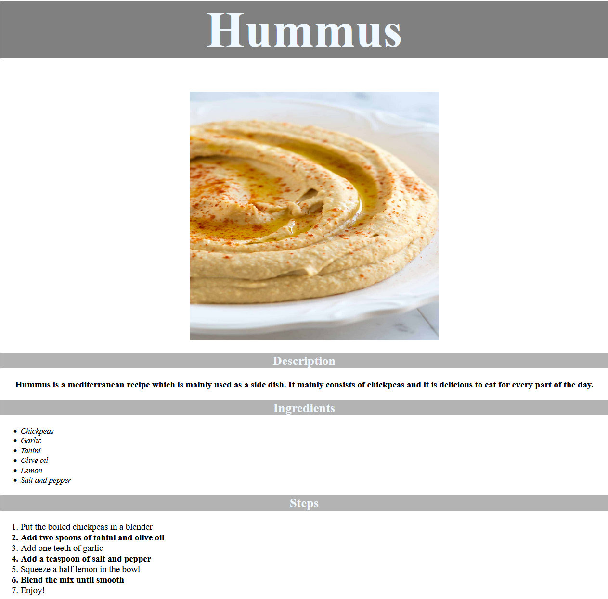

# Odin recipes

This project uses HTML and CSS to practice basic HTML, CSS and Git.

## The Odin Project: Lesson Recipes

This project is build according to the specification of the [Recipes lesson](https://www.theodinproject.com/lessons/foundations-recipes)

## Live website

Access [Odin recipes](https://gohan61.github.io/odin-recipes/)

